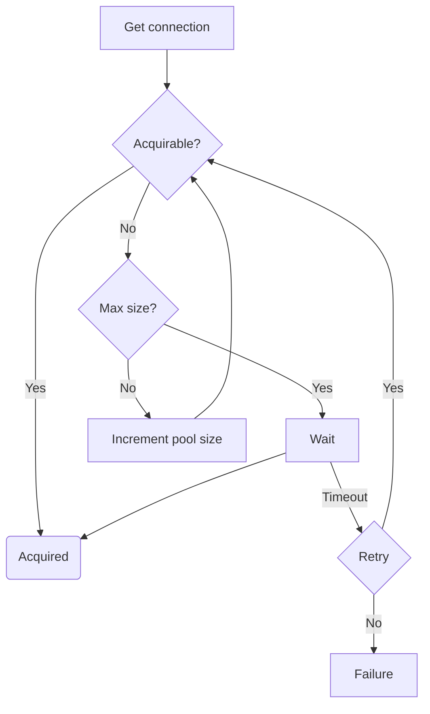

# Why connection pooling is important?
To understand importance of connection pooling we first need to understand how the application interacts with database.

1. The data layer in the application requests the datasource for a database connection.
2. Underlying driver opens a physical connection.
3. TCP socket is opened after physical connection establishment.
4. Datasource lends the physical connection to the application layer.
5. Using acquired connection from datasource applucation executes the statements.
6. TCP socket and physical connection is closed when the connection is no longer needed.

Following above steps for each user becomes very costly and waste of resources.

A connection pool is a cache of database connections maintained so that connections can be reused when future requests to the database are required.
It avoids overhead for establishing a TCP connection, thus cutting the amount of time a user must wait to establish a connection to the database.
Another advantage for JVM applications, client-side object garbage is also reduced.

# How does connection pooling work?

1. Whenever there is a request for a connection, the pool looks for unallocated connections.
2. The pool handles the connection to the client if it finds one.
3. In the case of no free connection, the pool will try to grow to its maximum allowed size.
4. The pool retry several time before giving up with a connection acquisition if the pool already reached its maximum size.
5. When the client closes the logical connection, the connection is released and returns to the pool without closing the underlying physical connetion.

